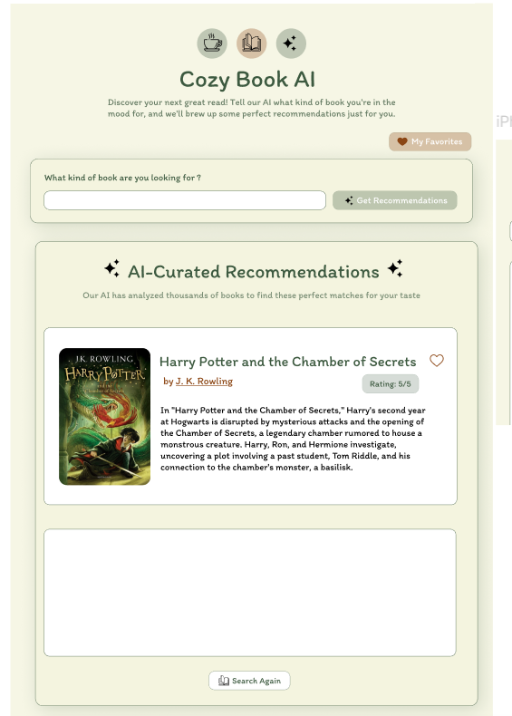
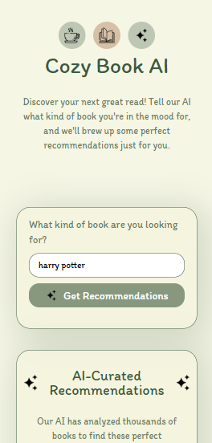
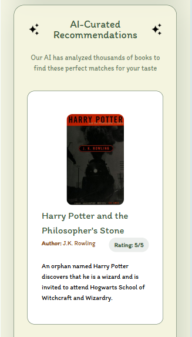
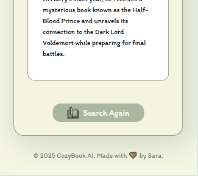

# 📚 Cozy Book AI

**Cozy Book AI** is an AI-powered book recommendation platform — **designed, developed, and deployed entirely by me**.  
From the initial **Figma design** to **frontend & backend development** and **live deployment**, I handled every stage of the process.

---

## 🎯 Project Overview
The goal was to create a simple yet engaging app that suggests books based on the user’s search or mood.  
I wanted the app to be **visually inviting**, and **secure** when dealing with API requests.

---

## ✨ Key Features
- 🎨 **Custom UI/UX** – Designed from scratch in **Figma** to ensure a clean and intuitive user experience.
- ⚡ **Frontend** – Built with **React + Vite** for high performance and quick load times.
- 🔒 **Backend Security** – API requests routed through a Node.js + Express backend to protect sensitive API keys.
- 📖 **Book Data** – Displays covers, titles, and descriptions for each recommendation.
- 📱 **Responsive Design** – Fully functional on desktop, tablet, and mobile.

---

## 🛠 Tech Stack
**Design:** Figma  
**Frontend:** React, Vite, Axios  
**Backend:** Node.js, Express  
**Version Control:** Git + GitHub  
**API:** OpenRouter AI (Free API key)
**Deployment:** Netlify (Frontend), Render (Backend)

---

## 🚀 How It Works
1. **User Input:** Type your book preferences or a title in the search box.
2. **API Request:** The backend sends your query to the AI API.
3. **AI Response:** The AI returns book recommendations with titles, authors, and book summary.
4. **Display:** The frontend renders the list of recommendations beautifully.

---

## 🐞 Challenges & Solutions
- **Challenge:** Keeping the API key secure.  
  **Solution:** Moved API calls to the backend so the key isn’t exposed in the frontend code.

- **Challenge:** Image mismatch for book covers.  
  **Solution:** Created a function to fetch cover images from Open Library’s API by searching with book title and author.

- **Challenge:** Deploying the backend.  
  **Solution:** Learned how to deploy the backend server securely on hosting platforms like Render.

---

## 📖 What I Learned
- Building a full-stack application from scratch.
- Designing in Figma and translating designs into React components.
- Backend fundamentals with Node.js and Express.
- Connecting frontend and backend using APIs.
- Practical React.js skills: using useState, conditional rendering, ternary operators, and passing props...
- API security basics.
- How to deploy a backend server securely with environment variables.
- Debugging and error handling.

---

## 📸 Screenshots

### Figma Design

### Live App

© 2025 Sara. All rights reserved.  